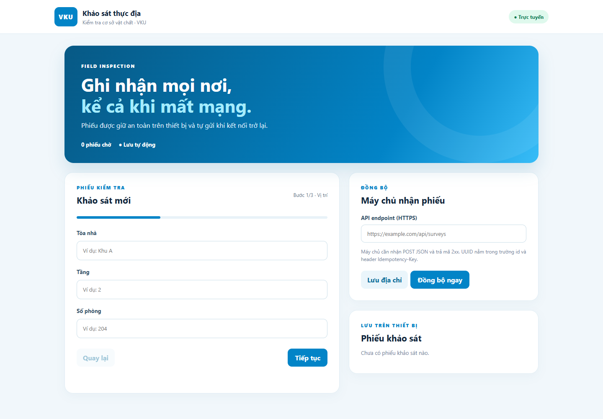

# Khảo sát thực địa VKU

PWA ưu tiên ngoại tuyến để kiểm tra cơ sở vật chất. Thanh tra có thể lập phiếu khi mất mạng; ứng dụng lưu bản nháp và hàng đợi trên thiết bị, sau đó gửi lên API khi kết nối trở lại.



## Tính năng

- Biểu mẫu ba bước: vị trí, hạng mục/đánh giá 1–5 sao/ghi chú, ảnh và GPS.
- Bản nháp lưu tự động trong IndexedDB; tải lại trang vẫn tiếp tục được.
- Phiếu chờ đồng bộ có UUID và thời gian tạo. Hàng đợi gửi tuần tự và chỉ chuyển sang `SYNCED` sau HTTP 2xx.
- Service Worker Cache-First cho App Shell, manifest standalone và biểu tượng 192/512 px.
- Camera, GPS và trạng thái mạng dùng Capacitor plugin khi chạy trên Android; bản web dùng khả năng tương ứng của trình duyệt.

## Chạy trên máy tính

Yêu cầu Node.js 20 trở lên.

```powershell
npm.cmd ci
npm.cmd run dev
```

Mở URL Vite hiển thị trên màn hình. Để thử API mẫu trong một terminal khác:

```powershell
npm.cmd run server
```

Nhập `http://localhost:8787/api/surveys` vào ô **Máy chủ nhận phiếu**. API mẫu ghi dữ liệu vào `surveys.json` (được loại khỏi Git). Trên HTTPS thật, dùng API HTTPS có thể truy cập từ thiết bị.

## Kiểm thử bản production

```powershell
npm.cmd run verify:pwa
```

Lệnh này build ứng dụng, mở Chrome, kiểm tra tải App Shell khi máy chủ dừng, khôi phục bản nháp, lưu phiếu vào hàng đợi và gửi phiếu khi máy chủ trở lại. Ảnh chụp kiểm thử nằm trong `docs/assets/`.

Build riêng: `npm.cmd run build`. Xem bản build: `npm.cmd run preview`. Service Worker chỉ được đăng ký ở bản production và cần HTTPS hoặc localhost.

## Triển khai URL demo HTTPS

### Cloudflare Pages

Kết nối repository GitHub này với Cloudflare Pages, chọn cấu hình:

| Mục | Giá trị |
|---|---|
| Framework | Vite |
| Build command | `npm run build` |
| Build output directory | `dist` |

### Vercel

Import repository từ GitHub, chọn Vite. Build command là `npm run build`, output directory là `dist`. Tệp `vercel.json` đã khai báo cache header cho Service Worker.

Trên một trong hai nền tảng, nếu đã triển khai Firebase Cloud Function, thêm biến môi trường `VITE_SURVEY_API_URL` bằng URL HTTPS function và triển khai lại. Nếu chưa có API, bản PWA vẫn dùng được ngoại tuyến; phiếu sẽ ở trạng thái chờ cho đến khi người dùng nhập endpoint hợp lệ.

## Firebase

Xem [hướng dẫn cấu hình Firebase](docs/FIREBASE_SETUP.md). Mã Cloud Function tương thích với API của ứng dụng nằm trong `firebase/functions`. Function nhận `POST` JSON, dùng UUID làm ID tài liệu Firestore và lưu ảnh vào Cloud Storage. Không đưa khóa quản trị hoặc service account vào ứng dụng web.

## Báo cáo

Bản Word và PDF ở `output/bao-cao-vku.docx` và `output/bao-cao-vku.pdf`. Chạy `node scripts/build-report.mjs` để tạo lại sau khi điền thông tin sinh viên và URL demo qua biến môi trường `REPORT_STUDENT`, `REPORT_DEMO_URL`. Báo cáo hiện dùng bố cục 3 trang theo nội dung đề; nếu giảng viên có mẫu riêng, cần đối chiếu và chỉnh theo mẫu đó trước khi nộp.

## Kiến trúc thư mục

| Đường dẫn | Vai trò |
|---|---|
| `src/main.ts` | Giao diện, biểu mẫu, ảnh/GPS và trạng thái mạng |
| `src/store.ts` | IndexedDB cho phiếu và cấu hình |
| `src/sync.ts` | Hàng đợi gửi tuần tự |
| `src/sw.ts` | App Shell Cache-First và Background Sync |
| `server.mjs` | API mẫu chạy cục bộ |
| `firebase/functions` | API Firebase để tự triển khai |
| `scripts/verify-pwa.mjs` | Kiểm thử PWA bằng Chrome |

## Android (tùy chọn)

Dự án Capacitor đã có trong `android/`. Cần Android SDK để chạy `npm.cmd run android:build`. APK không nằm trong ba sản phẩm nộp bắt buộc theo hướng dẫn hiện có.
